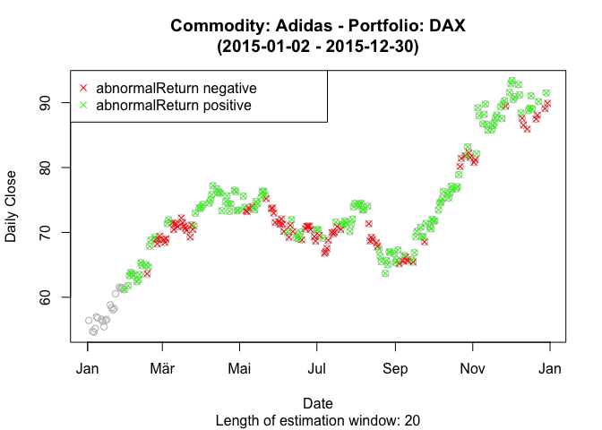

<!-- README.md is generated from README.Rmd. Please edit that file -->
Event study methodology for abnormal returns
============================================

[](https://travis-ci.com/axelperschmann/AbnormalReturns) [](https://cran.r-project.org/package=AbnormalReturns) [](https://codecov.io/gh/axelperschmann/AbnormalReturns)

**AbnormalReturns** implements the event study methodology and abnormal returns in particular. The event study methodology is a common way to study the effects of certain events on stock prices. It thus calculates a so-called abnormal return that measures the impact without confounding influences. As part of this method, one first has to predict a normal return in the absence of the event under study. Afterwards, one calculates the difference between the actual return and the previously predicted normal return, i.e. the abnormal return.

Overview
--------

**AbnormalReturns** provides a function `abnormalReturn()`, that returns a data frame including the abnormal returns and the R.squared value of the responsible model for each analyzed date.

To see example function calls, check out the help pages and the vignette.

Installation
------------

Using the **devtools** package, you can easily install the latest development version of **AbnormalReturns** with

``` r
install.packages("devtools")

# Option 1: download and install latest version from ‘GitHub’
devtools::install_github("axelperschmann/AbnormalReturns")

# Option 2: install directly from bundled archive
# devtoos::install_local("AbnormalReturns_0.1-0.tar.gz")
```

Notes:

-   In the case of option 2, you have to specify the path either to the directory of **AbnormalReturns** or to the bundled archive **AbnormalReturns\_0.1-0.tar.gz**

-   A CRAN version has not yet been released.

Usage
-----

This section shows the basic functionality of how to compute the abnormal returns for an arbitrary commodity and it's corresponding market portfolio. First, load the corresponding package **AbnormalReturns**.

``` r
library(AbnormalReturns)
```

### Quick demonstration

This simple example computes the abnormal returns for commodity Adidas and market portfolio DAX for the year 2015, based on an `estimationWindowLength` of 10. The result is a data-frame with one row per abnormal return and five columns describing Date, abnormalReturn, R.squared, stockReturn and marketReturn.

It also shows a visualization of the commodity performance and the corresponding abnormal returns.

``` r
abnormal = abnormalReturn(prices_stock="ADS.DE", prices_market="%5EGDAXI", model="marketmodel",
                          from="2015-01-01", to="2015-12-31", estimationWindowLength=20, c=3,
                          attributeOfInterest="Close", showPlot=TRUE)
```



``` r
head(abnormal)
#>                   Date abnormalReturn cumulativeAbnormalReturn stockReturn
#> 21 2015-01-30 01:00:00      0.4713908                       NA       61.19
#> 22 2015-02-02 01:00:00      0.3299405                       NA       61.79
#> 23 2015-02-03 01:00:00      1.4813249                 2.282656       63.33
#> 24 2015-02-04 01:00:00      1.6381956                 3.920852       63.83
#> 25 2015-02-05 01:00:00      1.2093413                 4.658802       63.65
#> 26 2015-02-06 01:00:00      1.1372783                 5.466140       63.39

summary(abnormal$abnormalReturn)
#>    Min. 1st Qu.  Median    Mean 3rd Qu.    Max. 
#> -3.4720 -0.4255  0.6554  0.8161  1.7180  7.0700
```

Further information
-------------------

-   Konchitchki, Y., and O'Leary, D. E. 2011. "Event study methodologies in information systems research," *International Journal of Accounting Information Systems* (12:2), pp. 99-115.
-   MacKinlay, A. C. 1997. "Event Studies in Economics and Finance," *Journal of Economic Literature* (35:1), pp. 13-39.
-   <http://eventstudymetrics.com/index.php/event-study-methodology/> , accessed: 27-07-2016

License
-------

**AbnormalReturns** is released under the [MIT License](https://opensource.org/licenses/MIT)

Copyright (c) 2016 Axel Perschmann, Stefan Feuerriegel & Nicolas Pröllochs
